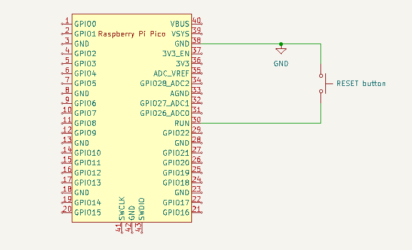

# Raspberry Pi Pico stuffs

## RESET button

Wire one button pin to GND (Pico pin 38 for example) and the other to RUN (Pico pin 30).

## Miscalleneaous

* [KiCad RPi Pico Library](https://github.com/ncarandini/KiCad-RP-Pico)
